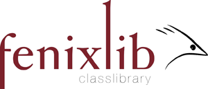

[](https://opensource.org/licenses/Apache-2.0)

FenixLib brings .Net support for opening, creating and operating with
native graphic, graphic collections, bitmap fonts and palette formats of
[PixTudio](https://pixtudio.org), [BennuGD](https://bennugd.org), 
[Div GO](http://www.amakasoft.com/herramientas/div-go.html) and 
[DIV](http://div-arena.co.uk/) game programming languages and frameworks.

Supported pixel format are _1bpp aligned packed_, _8bpp indexed_, _16bpp RGB565_
and _32bpp ARGB_, i.e. all native graphic file formats.

The following snippet shows how easy is to open a Fpg file, print the codes
and description of every map, change the description of map with code 10 and
save the changes in a new file.

```csharp
using FenixLib;
using FenixLib.IO;

// Load a Fpg file
var spriteAssortment = NativeFile.LoadFpg ( "foo.fpg" );

// Print out the code and description of every sprite in the Fpg
foreach ( var sprite in spriteAssortment )
{
  System.Console.WriteLine ( sprite.Id.ToString() + " - " + sprite.Description );
}

// Change the description of Sprite with code 10
spriteAssortment[10].Description = "Bar";

spriteAssortment.SaveToFpg ( "foo-changed.fpg" );
```

Another example, see how easy you can create a Fnt font file from scratch:

```csharp
using FenixLib;
using FenixLib.IO;

var font = new BitmapFont ( GraphicFormat.Format32bppArgb, FontEncoding.ISO85591 );

// Create a 10x10 transparent graphic
var glyphGraphic = new Graphic( GraphicFormat.Format32bppArgb, 10, 10, new byte[10 * 10 * 4] );

// Create the glyph and assign it to the letter 'å'
// å is a character that exists in the ISO8559-1 code page.
font['å'] = new Glyph ( glyphGraphic );

// Save the font to a Fnt file (only 'å' will contain a bitmap)
font.SaveToFnt ( "foo.fnt" );
```

For additional examples and documentation visit [the wiki](http://github.com/dacucar/fenixlib/wiki).

## Using the library

Add a reference to your .NET project by using the [nuget package](https://www.nuget.org/packages/FenixLib/)
or building it from the project file.

Check the [Core Types](https://github.com/dacucar/fenixlib/wiki/Core-Types) section in the wiki to learn
about the `FenixLib` core types of the FenixLib library that are used to manipulate the different
types of assets.

Most likely you'll want to load or save those assets from the filesystem. The `NativeFile` type of 
the `FenixLib.IO` namespace is a convenient facade to do exactly that.

You may also check the [example projects](https://github.com/dacucar/fenixlib/wiki/Examples).

## Building

FenixLib targets now .NET Standard 2.0 and should run on any .NET implementation that supports it, 
namely .NET Framework 4.6 and later, .NET Core and .NET 5.0.

Go ahead and make a clone of this repository:

    git clone https://github.com/dacucar/fenixlib.git

Then build the FenixLib class-library. If using .NET 5.0 SDK, run:

    dotnet build fenixlib/FenixLib

There exists some additional projects in the `fenixlib` folder:

* `FenixLib.Tests`: Test for fenix core assembly.
* `Examples/FenixLibAndGtk.csproj`: An example of how to use FenixLib together with Gtk-sharp.

### Running unit and integration tests

Test project depend on [NUnit 3](http://www.nunit.org/) and [Moq](https://github.com/Moq/moq).

Notice that originally, FenixLib used [Rhino Mocks](https://www.hibernatingrhinos.com/oss/rhino-mocks)
for test doubles and that code has been ported to Moq without much ambition (just making the test pass).

Use whatever test runner your .NET implementation provides you. I use .NET 5.0 and `dotnet test` command
to run the tests.

    dotnet test Src/FenixLib.Tests

## Contributing

Pull requests, issues and suggestions are welcomed. If you plan to do a large work it might be
a good idea to open an issue and tell a bit about what you intend to use.

## License

Copyright 2016 Darío Cutillas Carrillo

FenixLib is distributed under the very permissive 
 [Apache License, Version 2.0](http://www.apache.org/licenses/LICENSE-2.0)

You are free to use FenixLib in both commercial and non commercial and 
open or close source applications as long as you follow the terms of the 
License.
